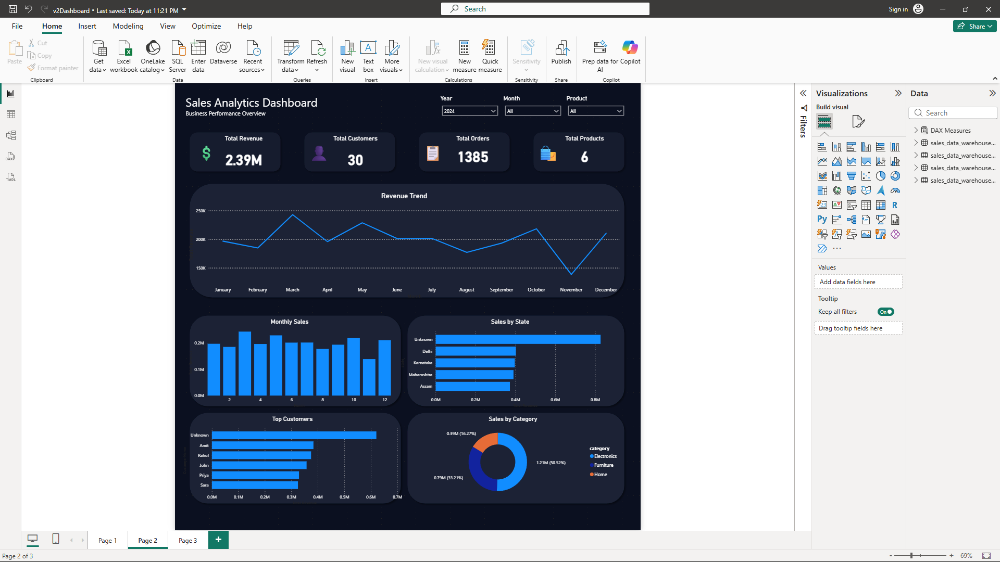

#  Sales Data Pipeline

##  Dashboard Preview



---

##  Project Overview

This project demonstrates an end-to-end **Data Engineering and Data Analytics pipeline**. It covers the complete workflow from raw sales data to an interactive Power BI dashboard using Python, SQL, MySQL, and Power BI.

The project includes:

-  Extracting sales data from a CSV file
-  Cleaning and preprocessing data using Python (Pandas)
-  Transforming the data into a Star Schema
-  Loading the transformed data into MySQL
-  Building an interactive Power BI dashboard
-  Analyzing business performance using DAX measures

---

##  Technologies Used

- Python
- Pandas
- SQL
- MySQL
- Power BI
- Git
- GitHub

---

##  Project Structure

```text
sales-data-pipeline/
│
├── dashboard/
│   └── SalesDashboard.pbix
│
├── image/
│   └── dashboard.png
│
├── data/
│   ├── raw/
│   │   └── sales.csv
│   ├── cleaned/
│   │   └── sales_cleaned.csv
│   └── warehouse/
│       ├── DimCustomer.csv
│       ├── DimDate.csv
│       ├── DimProduct.csv
│       └── FactSales.csv
│
├── scripts/
│   ├── extract.py
│   ├── clean.py
│   └── transform.py
│
├── sql/
│   ├── 01_create_database.sql
│   ├── 02_create_tables.sql
│   └── 03_sample_queries.sql
│
├── README.md
└── .gitignore
```

---

##  Data Warehouse

This project follows a **Star Schema** design to improve analytical performance.

### Fact Table

- FactSales

### Dimension Tables

- DimCustomer
- DimProduct
- DimDate

---

##  Power BI Dashboard

The dashboard provides interactive business insights including:

-  Total Revenue KPI
-  Total Orders KPI
-  Total Customers KPI
-  Total Products KPI
-  Revenue Trend
-  Monthly Sales
-  Revenue by State
-  Top Customers
-  Orders by Payment Method
-  Interactive Filters
  - Year
  - State
  - Product

---

##  Skills Demonstrated

- Data Extraction
- Data Cleaning
- ETL Pipeline Development
- Data Transformation
- Star Schema Design
- SQL Database Management
- DAX Measures
- Power BI Dashboard Development
- Data Visualization
- Git Version Control
- GitHub Project Management

---

##  How to Run

1. Clone this repository.

```bash
git clone https://github.com/databygaurav/sales-data-pipeline.git
```

2. Install the required Python libraries.

3. Run the Python scripts inside the `scripts` folder.

4. Execute the SQL scripts to create the database and tables.

5. Open:

```text
dashboard/SalesDashboard.pbix
```

using **Power BI Desktop**.

6. Refresh the dashboard if required.

---

##  Future Improvements

- Add sales forecasting
- Add profit and margin analysis
- Connect to a live SQL database
- Publish the dashboard to Power BI Service

---

##  Author

**Gaurav Dutta**

GitHub: https://github.com/databygaurav